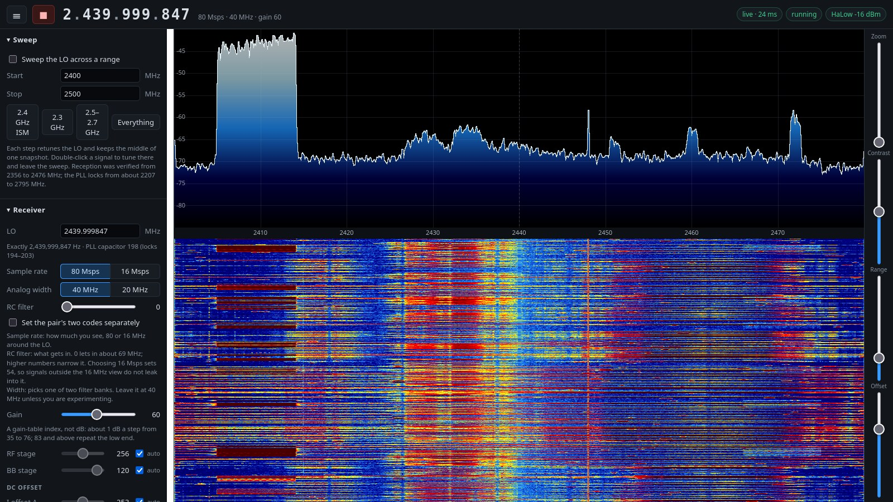

# HaLowScope

A 2.4 GHz spectrum analyzer you open in a browser over Wi-Fi HaLow.

An ESP32-S3 uses its own 2.4 GHz radio as a receiver, computes the spectrum
on the chip and serves a live spectrum and waterfall page over the board's
HaLow (802.11ah, sub-GHz) link. Any browser on the HaLow network can watch
and tune it, no software to install, as far away as HaLow reaches.

It covers about 2.21 to 2.79 GHz: 2.4 GHz Wi-Fi, Bluetooth and Zigbee, and
the 2.3 and 2.5 to 2.7 GHz bands, either as an 80 or 16 MHz wide live view
or as a sweep across the whole range.



*The page as served by the board over HaLow: 80 MHz around 2440 MHz, with
Wi-Fi bursts on channel 1 (2412 MHz) and the receiver controls on the left.*

## Hardware

The Elecrow "ESP32 WiFi HaLow Module": ESP32-S3 with 16 MB flash and 8 MB
PSRAM, a Quectel FGH100M HaLow module (Morse Micro MM6108), a camera
connector, a TF card slot and USB-C through a CH340 serial bridge. You also
need a Wi-Fi HaLow access point; the board was tested with Elecrow's
ThinkNode G4 gateway.

Pins, chips and what the stock firmware does are in
[docs/BOARD.md](docs/BOARD.md).

## How it works

The ESP32-S3's Wi-Fi radio has an undocumented sample-dump engine that
writes raw I/Q samples into SRAM, found by h0m3us3r's
[eSpDR](https://github.com/h0m3us3r/eSpDR). On this board the HaLow module
carries the network, so the S3's own radio is free to be a receiver: it is
never used for Wi-Fi and never transmits.

The firmware takes short snapshots (16384 samples: 0.2 ms at 80 Msps, 1 ms
at 16 Msps), runs windowed FFTs on them, averages or peak-holds the result
and sends one line of about 1 to 4 KB per frame to the browser. That is why
a slow, long-range HaLow link keeps up. In sweep mode the LO steps across
the chosen range and each step keeps the middle of one capture.

Measured on the test board:

| | |
|---|---|
| Live view | 80 MHz wide, 20 frames/s at any FFT size from 512 to 8192 points |
| Full sweep, 2210 to 2790 MHz | about 0.16 s (6 sweeps/s) |
| Retune | 2.5 ms once the PLL setting near that frequency is known, 25 ms the first time |
| History | about 7 minutes in memory; with a TF card, about 1.3 GB a day, days on a 16 GB card |

Snapshots mean the view is built from a small share of the samples (about
1 % in the live view). Steady signals show as they are; short bursts can
fall between snapshots, and the peak detector helps to catch them.

## What you need

- The board and a USB-C cable. On Linux the board appears as
  `/dev/ttyUSB0`; your user needs access to it (the `dialout` group on most
  distributions).
- [ESP-IDF 5.5](https://docs.espressif.com/projects/esp-idf/en/v5.5/esp32s3/get-started/index.html),
  installed for the ESP32-S3 (`./install.sh esp32s3`). It brings the
  compiler, `idf.py` and `esptool`.
- A Wi-Fi HaLow access point (see [The access point](#the-access-point)).

## Build

```
cd firmware
. $IDF_PATH/export.sh
idf.py set-target esp32s3
idf.py build
```

The first build downloads the Morse Micro HaLow component and esp-dsp from
the ESP component registry; there is no separate Morse Micro SDK to install
or account to create.

ESP-IDF's installer includes Ninja. If yours is missing, idf.py falls back
to Make, which does not see that the HaLow component's `libmorse.a` comes
from a custom build step, and the link fails. Build that step on its own
first:

```
idf.py reconfigure
cmake --build build --target morselib_build
idf.py build
```

## Back up the stock firmware

Do this once, before the first flash. The board's stock camera firmware
has no public source, so this backup is the only way back to it. Read the
whole 16 MB flash twice and compare the two copies; identical copies show
the read over the serial link was clean:

```
mkdir -p backup
esptool --port /dev/ttyUSB0 --baud 921600 read-flash 0 0x1000000 backup/stock.bin
esptool --port /dev/ttyUSB0 --baud 921600 read-flash 0 0x1000000 backup/stock-2.bin
cmp backup/stock.bin backup/stock-2.bin && echo identical
```

Each read takes about four minutes. Keep `backup/stock.bin` somewhere safe;
it also holds your board's HaLow settings and calibration.

## Flash

```
idf.py -p /dev/ttyUSB0 flash
```

This writes the bootloader, the partition table and the app. The NVS
partition, where the stock firmware stores the HaLow network, stays where it
is, so a board that already joined your network joins it again without
setup.

To go back to the stock firmware:

```
esptool --port /dev/ttyUSB0 --baud 921600 write-flash 0 backup/stock.bin
```

If esptool cannot connect, hold BOOT, press Reset, release BOOT and try
again.

## Join the HaLow network

The ESP32 runs the HaLow driver, so the network is set on the ESP32 (not on
the HaLow module) with the same serial command as the stock firmware. Open a
serial terminal at 115200 baud (opening the port may reset the board) and
send:

```
AT+CWJAP="your-halow-ssid","your-passphrase"
```

The board stores the network and joins it. Other commands:

| Command | |
|---|---|
| `AT+CWJAP?` | stored network, link state and address |
| `AT+RST` | restart |
| `AT+SDFORMAT=YES` | erase the TF card and make one FAT32 partition across it |

The board takes its address by DHCP and prints it on the console:

```
I (7250) link: IP 192.168.1.50, open http://192.168.1.50/
```

The HaLow gateway's list of connected devices shows it too.

### The access point

The firmware joins WPA3-SAE networks and uses the US channel plan; change
`CONFIG_HALOW_COUNTRY_CODE` in `firmware/sdkconfig.defaults` for another
country. The access point has to use the same country.

Something on the network has to hand out addresses. A gateway set up as a
router (or with no upstream network) runs its own DHCP server. One set up
as an Ethernet bridge passes DHCP through to the upstream network, so that
network needs a DHCP server; without one the board joins but gets no
address.

For setting up the access point itself, see its manual. For the ThinkNode
G4, the [ESP32 WiFi HaLow Module user manual](https://www.elecrow.com/download/product/LMM15303D/User_Manual_of_ESP32_Wi-Fi_Halow_Module.pdf)
walks through the gateway's HaLow access point setup.

## Use

Open `http://<board address>/` in a browser with WebGL 2 (any current
desktop or phone browser).

- Tune: scroll or click the digits at the top, type a frequency, or
  double-click a signal in the plot.
- Zoom with the wheel or a pinch, drag sideways to pan, click to place a
  marker.
- **Go back in time**: drag the waterfall up or down, or scroll over the
  time rail that appears on the waterfall's left edge when the pointer
  comes near. Ctrl + wheel over the rail zooms time; its thin strip is an
  overview of everything kept, and clicking it jumps there. Hovering a past
  row shows its spectrum. End or *Back to live* returns. See
  [History](#history).
- **Sweep**: tick *Sweep* or pick a preset to step across a range.
  Double-clicking a signal leaves the sweep and tunes there.
- **Receiver**: sample rate (80 or 16 Msps), analog width, baseband filter,
  gain and, for experiments, the gain stages, DC offsets and I/Q correction.
  The gain is a table index, not dB. The default, 60, is where the noise
  floor starts to rise above the converter's own; more gain adds little
  sensitivity and costs headroom for strong signals.
- **FFT**: resolution (512 to 8192 points), window, frame rate, averaging,
  average or peak detector, DC removal.
- **Device**: HaLow signal strength, memory and capture timing.

One browser at a time controls the receiver; opening the page somewhere
else takes over.

The page has no password: anyone who can reach the board on the HaLow
network can watch and retune it.

## History

The board records every spectrum line, whether or not anyone is watching,
so a page opened after something happened can scroll back to it; a newly
opened page shows the recent past in its waterfall straight away.

- **In memory**: frames are merged by max-hold into a line every 100 ms or
  so (a short burst survives) and the last several minutes are kept in
  PSRAM, about 7 minutes of the live view.
- **On a TF card**, if one is in: every line is archived as well, plus a
  coarse line every 2 seconds for zoomed-out views, so history reaches back
  hours and days and survives restarts. About 1.3 GB a day; when under 1 GB
  is left, the oldest hours go first. The card is never formatted by
  itself: use a FAT32 card (8 to 32 GB come that way), or erase one with
  `AT+SDFORMAT=YES` on the serial console. Files are in `halowscope/` on
  the card.
- **Clock time**: with internet on the HaLow network the board sets its
  clock by NTP, and the time rail shows clock times; without it, the first
  browser to connect lends its clock. The card archive needs one of the two,
  as it is indexed by time.

Scrolling back asks the board for one row per screen line; over HaLow a
full screen takes a few seconds to arrive and draws as it comes. History
from the card loads more slowly than history in memory.

## Span, filter and width

Three receiver settings sound alike but do different things:

- **Sample rate** is how much you see: 80 MHz around the LO at 80 Msps,
  16 MHz at 16 Msps.
- **RC filter** is what gets in. Code 0, the default, lets in about 69 MHz:
  measured flat to about 25 MHz from the LO, 5 dB down at 39 MHz and gone
  by 55 MHz. So the edges of the 80 MHz view read a few dB low, and a strong
  signal just outside the view can show up folded inside it (eSpDR saw one
  46 MHz from the LO). Higher codes narrow the filter; at code 54 a signal
  7 MHz from the LO still came through about 1 dB down, while ones 9 and
  23 MHz outside a 16 MHz view no longer did.
- **Width** (40 or 20 MHz) picks one of two analog filter banks, each with
  its own pair of RC filter registers. It is named after Wi-Fi channel
  widths and is not the width of the view; leave it at 40 unless you are
  experimenting.

16 Msps is the 80 Msps capture with four of every five samples dropped and
no digital filter, so with the wide filter everything it lets in folds into
the 16 MHz view. Choosing 16 Msps therefore also sets filter code 54, and
choosing 80 Msps sets it back to 0. On the test board that lowered the
16 Msps noise floor by about 7 dB.

## Limits

- Snapshots, not a continuous stream (see above).
- It cannot see the HaLow band itself: the ESP32-S3's radio tunes 2.21 to
  2.79 GHz only.
- Reception was verified from 2356 to 2476 MHz; the rest of the range locks
  and shows signals but has not been checked against a known source.
- Levels are dBFS, not calibrated to dBm.
- History travels over HaLow: a screen of it takes a few seconds, and while
  a large amount comes off the card the live view can pause for a few
  seconds.
- The camera is not used.

## Credits

- [eSpDR](https://github.com/h0m3us3r/eSpDR) by h0m3us3r (0BSD): the
  receiver bring-up, tuning and sample capture, and the web page, which this
  firmware serves in adapted form. Further receiver work from
  [alphafox02/eSpDR](https://github.com/alphafox02/eSpDR).
- Morse Micro's [HaLow component for ESP-IDF](https://components.espressif.com/components/morsemicro/halow).
  Its HaLow driver (morselib) is GPL-3.0-or-later or Morse Micro's
  commercial license, and the MM6108 firmware it loads is under Morse
  Micro's binary distribution license. That is why this project publishes
  source only, no prebuilt images; see NOTICE.
- Espressif's [esp-dsp](https://components.espressif.com/components/espressif/esp-dsp)
  (Apache-2.0) for the FFTs.
- The filter measurements quoted above are eSpDR's; its filter code
  calibration came from [ESP-SDR](https://github.com/ESPARGOS/esp-sdr).

See [NOTICE](NOTICE) for details.

## License

This project's code is 0BSD, see [LICENSE](LICENSE). Copyright 2026
CEMAXECUTER LLC. The components the build downloads keep their own
licenses; see [NOTICE](NOTICE).
